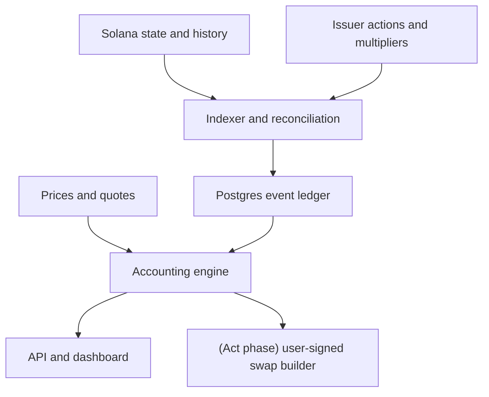

# Tokenized-stock dividend income on Solana

Implementation plan · v2 · 13 September 2026

> **What changed from v1, and why.** v1 was scoped as a full product: an
> 8-week build ending in an audited on-chain vault that harvests dividends
> and runs recurring buys unattended. The engineering in v1 was sound — the
> rebase mechanics, the protected-floor accounting, and the units discipline
> were all correct. But it committed a whole company's worth of work before
> confirming the two things the product actually depends on: (1) that the
> dividend-paying tokenized stocks have enough real holders to matter, and
> (2) that the automated "convert and buy" flow doesn't cross into regulated
> brokerage activity. v2 puts those two checks first, makes the **Observe-only
> tracker the core product**, and moves the vault/keeper/automation into a
> clearly-gated later phase that only begins if the wedge is validated. The
> insight of this product is making an invisible rebase legible. That insight
> ships in ~10 days with no custom program and no audit. Everything past it is
> a separate, heavier bet.

---

## 0. Validate before building (do this first, in this order)

These two checks decide whether there is a product at all. Each costs less
than a day. **Do not write application code until both clear.** If either
fails, the honest outcome is to stop, and that is a cheap thing to learn now
rather than after an 8-week build.

### 0.1 Demand check — do the dividend-paying tokens have holders?

The premise of this product is that tokenized-stock holders have dividends
worth seeing. But the most liquid, widely-held xStocks are growth names
(NVDA, TSLA) that pay little or nothing — that is precisely why they were
chosen for tokenization. The dividend-paying tickers (e.g. SPYx, KOx, JNJx,
and other income names) may have few holders. If so, the tracker is elegant
engineering around an event that rarely fires for anyone.

Concretely, before anything else:

- [ ] For every dividend-paying tokenized stock on Solana, pull current
      unique holder count and total supply from RPC / RWA.xyz / the issuer
      API.
- [ ] For each, pull the multiplier-change history and count actual dividend
      activations in the last 12 months.
- [ ] Cross the two: **how many real wallets have received at least one
      dividend rebase on an xStock in the last year, and what was the median
      USD value of those events?**

**Go/no-go:** if the answer is "a few hundred wallets, cents per event," the
product is real but the market is negligible — stop, and say so. If it is
"thousands of wallets with material distributions," proceed. Either way you
have spent an afternoon, not a quarter. Record the numbers in an ADR; they
also become the honest slide in any pitch.

### 0.2 Regulatory boundary check — where does "track" become "manage"?

Displaying a holder's own dividend information touches nothing and is almost
certainly fine. Selling the dividend-equivalent portion of a tokenized
*security* into USDC on the user's behalf — especially on a schedule, via a
vault the app controls — moves toward operating an unlicensed brokerage or a
discretionary managed account. The line between the two is the difference
between a weekend project and a licensed financial business.

- [ ] One written read from securities counsel on: (a) is a read-only
      dividend tracker a regulated activity in the target jurisdiction(s);
      (b) at what point does user-directed conversion become
      broker-dealer / investment-adviser activity; (c) does an app-controlled
      vault that sells on a schedule constitute discretionary management.
- [ ] Confirm the target audience against issuer geographic/person
      restrictions. xStocks are not available to US persons; eligibility must
      not be inferred from wallet connectivity.

**Go/no-go:** if read-only tracking is clean (expected), **Phase 1 ships
regardless of the answer on automation.** The automation phases (3+) do not
begin until the boundary is drawn and the required posture (licensing,
partnership, or a narrower non-discretionary design) is decided.

---

## 1. What to ship

Build a dashboard that makes tokenized-stock dividends **legible**: it
detects the rebase that delivers a dividend, records the income it
represents, values it, measures yield, and clearly separates what is retained
stock exposure from what could be converted to cash.

The core product — the thing that is genuinely absent from every existing
interface and confirmed absent by the issuer's own support docs — is the
**evidence-backed income ledger**. That is Phase 1 and Phase 2. It needs no
custom program and no audit.

Everything beyond that (unattended harvesting, recurring buys from a
program-controlled vault) is a **separate, heavier bet** documented in
Appendix A. It begins only if Phase 0.1 shows real demand and Phase 0.2
resolves the regulatory boundary.

Ship in increments:

1. **Observe (core):** connect a wallet, reconstruct holdings, identify
   verified dividend events, show income and the evidence behind it. This is
   the product. If you build only this, you have shipped the wedge.
2. **Act (optional, pending 0.2):** quote and execute a *user-signed* sale of
   the dividend-equivalent portion into USDC. No custody, no automation — the
   user signs each transaction in their own wallet.
3. **Automate (deferred — see Appendix A):** program vault, bounded
   harvesting, scheduled buys. Only after validation, counsel, and audit.

### Product contract

| User sees | Exact meaning |
|---|---|
| Dividend income | Dividend-attributed additional stock exposure; USD amount is an estimate unless issuer valuation evidence is available |
| Available to convert | The remaining dividend-equivalent portion of a tracked position, subject to current balance and execution checks |
| Received in USDC | Actual finalized proceeds from a user-signed sale |
| Retained in stock | Dividend-equivalent exposure remains in the stock; it is not cash |
| Stock adjustment | A split, reverse split, correction, or unresolved multiplier change; not automatically income |

Default mode is **retain in stock** — the product's job is to *show* income,
not to push anyone to sell it. Do not add yield farming, leverage, pooled
vault shares, bank payouts, cross-chain tracking, tax filing, or automated
purchases to the core product.

---

## 2. Verified mechanics and integration decisions

> This section is carried forward from v1 largely intact — it was correct.
> The mechanic is the foundation and it verifies.

### Issuer behavior

xStocks delivers the economic benefit of dividends by **reinvestment into the
same underlying stock, net of withholding, reflected through multiplier
changes** — not as cash. Splits and reverse splits also change that
multiplier. **Therefore an increase alone cannot establish dividend income**;
it must be classified against issuer evidence.
[xStocks dividend mechanics](https://docs.xstocks.fi/docs/dividends-and-stock-splits)

On Solana this is the **Scaled UI Amount** extension: it changes displayed
quantity while token-account base units stay unchanged. Config includes
current and pending multipliers and an activation timestamp; conversions use
floating-point and may not round-trip exactly.
[Scaled UI Amount spec](https://solana.com/docs/tokens/extensions/scaled-ui-amount)

**Implementation decision (unchanged, and load-bearing):** observe the
**mint**, not just token accounts. A scheduled activation can happen with no
account write, so a balance-subscription-only design will silently miss every
dividend. Preserve historical multiplier versions; use raw integer amounts
for transaction construction; normalize prices and quantities into matching
units.
[Integration guide](https://solana.com/docs/tokens/extensions/scaled-ui-amount/integration-guide)

Native Solana deployments use Token-2022.
[xStocks developer overview](https://docs.xstocks.fi/developers)

### APIs to integrate

| Integration | Documented surface | Use |
|---|---|---|
| xStocks assets | `GET https://api.xstocks.fi/api/v2/public/assets` and `/public/assets/{symbol}` | Resolve canonical deployment addresses and underlying identifiers |
| xStocks current multiplier | `/public/assets/{symbol}/multiplier?network={NETWORK}` | Reconcile mint state and pending activation |
| xStocks multiplier history | `/public/assets/{symbol}/multiplier/history?network={NETWORK}` | Backfill and compare historical transitions |
| xStocks price data | `/public/assets/{symbol}/price-data` | Supplement valuation after verifying units and timestamps |
| Corporate actions | Public Corporate Actions operations in issuer OpenAPI | Classify transitions; **schema unverified — exercise in Phase 0** |
| Solana RPC + archival stream | Mint/account state, finalized transactions, ordered historical changes | Canonical balances and observed multiplier transitions |
| Jupiter Swap V2 | `GET https://api.jup.ag/swap/v2/build` | Obtain raw swap instructions (Act phase only) |

Resolve the network enum from the current schema rather than guessing.
**The corporate-action response schema and live API availability have not
been exercised for this plan** — confirming them is a Phase 0 task, and if the
corporate-action feed is unavailable or unreliable, classification quality
drops and the tracker must degrade honestly to "unclassified adjustment"
rather than guess.

**Recurring-buy note (Act/Automate only):** Jupiter's legacy Recurring API is
unmaintained; Trigger V2 is beta, documents a $10 minimum per round, and
exposes no user-configurable DCA slippage — which conflicts with small
variable dividends. If automation is ever built, schedule against the app's
own funded USDC and reuse the swap executor rather than depending on Trigger
V2.
[Jupiter Build](https://developers.jup.ag/docs/swap/build)

Everything below is a proposed design, not a claim that the issuer or Jupiter
already provides these features.

---

## 3. Architecture (core product)

For Phase 1–2, the stack is deliberately boring and program-free:

- **Next.js + TypeScript** app.
- **Fastify** API.
- **Postgres** as the durable, immutable event ledger.
- A **persistent worker** for indexing and reconciliation (not request-scoped
  serverless — subscriptions and reconciliation must run continuously).
- **Zod** at integration boundaries; **decimal/rational** arithmetic in the
  accounting package.
- **No Rust/Anchor** in the core product. Anchor appears only in Appendix A.



| Path | Responsibility |
|---|---|
| `apps/web` | Wallet connection, income dashboard, event evidence, (Act) transaction review |
| `apps/api` | Auth, validated reads, quotes, user-signed intents, export |
| `apps/worker` | Ingestion, replay, issuer sync, attribution |
| `packages/domain` | Unit types, action states, API contracts |
| `packages/accounting` | Pure deterministic ledger reducer, principal/income partition, metrics |
| `packages/solana` | Mint decoding, transaction decoding, wallet SDK bridge, simulation |
| `packages/issuers` | xStocks adapter and future issuer interfaces |
| `packages/execution` | (Act) Jupiter builder + transaction verifier |
| `packages/db` | Schema, migrations, outbox, queries |
| `fixtures` | Sanitized chain/issuer recordings and synthetic scenarios |
| `ops` | Deployment, alerts, restore/incident runbooks |

Commit ledger writes and job-outbox rows in the same transaction. Scale by
mint ingestion and indexed holder fan-out, not per-wallet polling.

---

## 4. Feasibility spike (Phase 0 engineering, days 1–2)

Runs alongside the 0.1/0.2 validation checks. Proves the mechanic on real
data before the dashboard is built around assumed behavior.

- [ ] Resolve 3–5 native Solana xStock mints; verify program owner, decimals,
      full extension set, update/freeze authorities, trading status.
- [ ] Find an actual historical dividend **and** a split with matching issuer
      evidence and chain transitions. If no live event is available, use
      historical replay plus clearly-labeled synthetic events.
- [ ] Decode multiplier fields from mint bytes, including the binary
      floating-point representation; compare against issuer API and RPC
      display.
- [ ] Confirm action IDs, net/gross fields, correction semantics, timestamps,
      pagination, coverage, and reuse rights from issuer API responses.
- [ ] Prove balance history for token accounts that were later closed, and
      ownership changes; pick an archival provider that actually supplies it.
- [ ] Establish each price provider's unit convention against a known non-1
      multiplier.
- [ ] (Act phase only) Obtain representative xStock→USDC routes and simulate.
      Do not infer route support from a token appearing in metadata search.
- [ ] Record all dependencies, provider limits, and unresolved assumptions in
      an ADR.

**Go/no-go:** attribution needs event classification plus reliable historical
ownership. If historical coverage is incomplete, ship "tracked since [date]."
If classification evidence is missing for an event, show "unclassified
adjustment" with conversion disabled for it. **Never fabricate mint addresses,
API fields, live dividends, or integration success in demo data.**

---

## 5. Detection and historical reconstruction

> Carried forward from v1 — this section was correct and is the technical
> heart of the tracker. Condensed here; the full runtime algorithm,
> classification table, and wallet-history rules from v1 §5 apply unchanged.

Persist immutable observations before interpretation (multiplier transitions
and corporate actions as separate typed records, each with an evidence hash
and distinct timestamps for issuer date / configured activation / publication
block time / first-observed-active / ingestion time).

Runtime essentials:

1. Subscribe to each allowlisted mint and indexed token accounts; poll mint
   state every 30–60s as a reconciliation fallback.
2. Decode pending transitions and **schedule activation checks independently
   of account-write subscriptions** (this is the trap — a dividend activates
   with no transfer).
3. Supersede replaced-before-activation updates; never book their income.
4. Determine balance boundaries from finalized chain progression and ordered
   history, not local wall-clock time.
5. Join transitions with versioned issuer evidence; preserve every match and
   rejection reason.
6. Emit confirmed income only after the necessary history and classification
   are complete; quarantine ambiguous boundary holdings.

Classification is by **evidence, never by size** — a small split resembles a
dividend and a special dividend can be large:

| Evidence | Result |
|---|---|
| Finalized transition + matching dividend record + reconciled factors | Confirmed dividend |
| Matching split/reverse split | Adjust quantity basis; zero income |
| Positive change, no matched action | Unclassified adjustment; no spending |
| Combined actions | Decompose by issuer factors/ordering; else quarantine |
| Correction / conflicting sources | Pause affected conversion; append correction |
| Announced dividend, no transition yet | Upcoming; not spendable |

Wallet history: replay per token account (including non-associated and closed
accounts, inner instructions, resolved lookup tables) and aggregate by
ownership at each event. Same-owner transfers are neutral; a receiving wallet
gets no historical income just because received tokens carry a high
multiplier. Expose `coverageStart`, `coverageEnd`, and gaps; exclude
unsupported positions visibly rather than assigning them zero income.

---

## 6. Accounting

> Carried forward from v1 **unchanged** — I verified this section
> independently and it is correct, including the protected-floor logic and the
> worked example. This is the part most implementations would get subtly
> wrong; keep it exactly as specified.

### Units

- `R`: integer base units. `D = 10^decimals`. `B = R/D`. `M`: active
  multiplier. `Q = B × M`: displayed quantity.
- `pScaled`: USD per displayed unit. `pUnscaled = M × pScaled`.
- Value identity: `Q × pScaled = B × pUnscaled`. **Never multiply a scaled
  balance by an unscaled price.**
- `R` is BigInt / integer numeric, serialized as string. Preserve original
  multiplier bytes; derive an exact rational for accounting. Never use JS
  `number` for money; never apply a blanket epsilon that could erase small
  dividends.

### Event income

For a verified dividend-only transition on eligible balance `R_event`:

```text
Q_before = (R_event / D) × M_before
Q_after  = (R_event / D) × M_after
dividend_quantity   = Q_after - Q_before
income_estimate_usd = dividend_quantity × event_price_scaled
```

With a verified split factor `S` combined with a dividend:
`dividend_quantity = Q_after - (Q_before × S)`. A pure split yields zero
income. Negative residuals are corrections, not negative dividends.

Prefer issuer reinvestment price / net cash allocation for USD valuation;
otherwise a contemporaneous scaled market price labeled **estimated**. Missing
price → retain quantity with USD `null`, never zero. Do not deduct
withholding twice.

### Protected floor (the core accounting idea)

Historical income and currently-convertible exposure are different ledgers.
Maintain a **protected stock-quantity floor `P`** per position epoch:

- New purchase/deposit: `P += deposited_raw / D × current_M`.
- Dividend: **`P` unchanged.**
- Verified split: `P = P × S`.
- Price moves: no effect on `P`.

```text
available_quantity  = max(0, current_Q - P)
protected_raw       = ceil(P × D / current_M)
maximum_harvest_raw = max(0, R_current - protected_raw)
```

Harvesting consumes available exposure and leaves `P` unchanged. `ceil`
ensures rounding always favors keeping the user's principal. **Why it
matters:** naively summing every historical dividend into a spendable balance
double-counts, because retained dividend exposure earns further dividends. The
floor computes what is convertible *now*, including growth of retained
exposure, without minting a second claim.

Ordinary external sale of `W` raw units: `P_after = P_before × (R_before − W)
/ R_before`, removing the same proportion of unharvested income while
preserving historical income earned.

The worked example, ledger invariants, and yield metrics from v1 §6.4–§7
apply unchanged. Do not headline an APY from a single distribution; show
coverage and valuation status on every metric.

---

## 7. Core product surfaces (Phase 1–2)

### Dashboard

Four primary values: **dividend income**, **available to convert**, **USDC
received**, **tracking-start date** (shown prominently — coverage honesty is
the whole credibility of the product). Position rows show scaled quantity,
value, recent dividend, available income, yield period, status. Keep raw
multipliers out of the main flow; put chain evidence in expandable detail.

### Event detail

> "Your position gained 0.04 stock-equivalent units from a verified dividend
> adjustment. Estimated value at the event: $8.12. This remains invested in
> the stock." — with issuer action, date, valuation source, transaction link.

A split reads "Stock split applied; no dividend income recorded." Missing
evidence reads "Balance adjustment detected; classification pending." **Never
show a green income toast for an unclassified increase.**

### Act phase (user-signed, no custody)

If Phase 0.2 clears read-plus-user-signed-conversion: the user selects a
position, sees a fresh exact-input quote (units sold, minimum USDC, all fees,
quote lifetime), and the app builds a transaction the user signs **in their
own wallet**. The builder must decode and validate the transaction before
signing — expected token programs, source/destination owners, allowed route
programs, raw debit, minimum output — and reject any unexpected transfer,
approval, authority change, or account closure. Reconcile against finalized
balance deltas, not an optimistic toast.

This path has **no vault, no keeper, no custody, no automation**. It is a
convenience wrapper over a swap the user authorizes each time. Do not label it
"principal protected on-chain" — a normal wallet can move funds between quote
and signature.

---

## 8. Delivery sequence (core product)

Assumes one or two engineers. A solo developer sequences the same gates on a
longer calendar.

| Phase | Estimate | Work | Exit gate |
|---|---|---|---|
| **0. Validate** | Days 1–2 | Demand check (0.1), counsel read (0.2), feasibility spike (§4) | Real holder/dividend numbers; regulatory boundary drawn; mechanic proven on real bytes |
| **1. Ledger + tracker** | Days 3–7 | Indexer, backfill, classification, accounting reducer, dashboard | Historical dividend + split replay, exact reconciliation, honest partial coverage |
| **2. User-signed cash-out** | Days 8–10 | Quotes, transaction verification, signatures, receipts, export | End-to-end demo; controlled mainnet manual canary |
| **— decision point —** | | Is demand real (0.1)? Is automation legally clear (0.2)? Is there user pull for it? | Explicit go/no-go on Appendix A |

**The first ~10 days ship the entire wedge.** The tracker is the insight; the
user-signed conversion is a thin, unregulated-if-0.2-clears convenience. Stop
here unless the decision point clears.

### First demo script (core)

1. Connect a test wallet holding a supported token.
2. Show raw quantity, displayed quantity, protected floor in debug detail.
3. Schedule a dividend multiplier change; let it activate with no account
   transfer.
4. Show the verified dividend entry, extra quantity, estimated event value.
5. Apply a split; confirm income does **not** increase.
6. (If Act enabled) user signs a conversion of the available portion; show the
   real receipt.

Keep synthetic demo events visibly separate from verified mainnet history.

---

## Appendix A — Deferred: unattended automation (do not start without the decision point)

> This is the entire vault/keeper/oracle design from v1 §10–§11. It is
> **correct engineering** and is preserved for when/if it is needed — but it
> is a different, heavier product than the wedge. It introduces custody, a
> trust assumption (the classification oracle), an audit requirement, and the
> regulatory questions of discretionary management. **It begins only after
> Phase 0.1 shows real demand, Phase 0.2 resolves the boundary, and there is
> evidence users actually want automation rather than a tracker.**

The deferred scope, in brief (full spec in v1 §10–§11, §13–§15 program tests):

- **Per-user program vault** (Anchor): owner-isolated position per mint plus an
  income-USDC account. Owner signs deposits and policy; a keeper pays fees and
  triggers permitted operations but never holds a user key. No pooled
  accounting, no transferable vault-share token.
- **Classification oracle**: 2-of-3 independent signers approve
  evidence-backed action records. This is an explicit **trust assumption, not
  a trustless dividend proof** — a compromised quorum could misclassify a
  split and authorize excess sales within caps. Requires conservative
  owner-set caps, alerts, multisig config, and external review.
- **Bounded harvest CPI**: atomic checks (active policy, non-replayed intent,
  complete action sequence, fresh valuation, activation guard window),
  on-chain recomputation of `maximum_harvest_raw`, a restricted CPI adapter
  for the exact verified Jupiter route, and full post-swap reconciliation with
  rollback on any failure.
- **Emergency exit that works with keeper and attestors offline** — a hard
  requirement, not a feature.
- **Execution reliability**: the full intent state machine, persisted signed
  transactions, rebroadcast-don't-rebuild on timeout, receipt uniqueness, and
  the economic-limit defaults (slippage ceiling, quote max age, minimum
  economic order size, corporate-action guard) from v1 §11.
- **Security gate**: external audit, hostile-execution and replay tests, restore
  drills, funded per-route canaries. "This document authorizes planning, not
  live fund movement."

If automation is pursued, its own Phase 0 is the securities-counsel
determination on discretionary management — resolved **before** the 8-week
build, not after.

---

## Appendix B — Operations & data (core product)

Carried from v1 §8, §14, condensed to what the tracker needs:

- Postgres with point-in-time recovery; immutable raw-event storage with
  hashes; a primary RPC/history provider plus an independent reconciliation
  RPC.
- Integer numeric for raw amounts; rational or audited fixed-point for the
  floor; separate decimal USD. **No floating SQL columns for ledger values.**
- CI gates: lint/typecheck, accounting fixtures + property tests, migration
  checks, integration replay, transaction-decoder tests.
- Monitoring: finalized indexing lag (p95 < 60s), income publication latency,
  exact raw-unit reconciliation at checkpoints (any mismatch disables affected
  conversion), price/issuer staleness per feed.
- Incident rules: pause the affected mint on source disagreement; keep reads
  available; corrections use reversal/replacement entries and never erase a
  settled receipt.
- Confirm audience against issuer geographic/person restrictions; do not infer
  eligibility from wallet connectivity.

---

## Release checklist (core product)

- [ ] **0.1 demand numbers recorded**; product proceeds only if material.
- [ ] **0.2 counsel read recorded**; Act phase enabled only if clear.
- [ ] Supported assets come from issuer identities + live mint verification.
- [ ] A confirmed dividend is distinguishable from a split, forecast, and
      unclassified adjustment.
- [ ] Scheduled events, late ingestion, historical transfers, and corrections
      replay deterministically.
- [ ] Partial ownership/price history is visible and excluded from yield
      claims.
- [ ] Available conversion uses the current protected-floor partition, not
      cumulative historical USD income.
- [ ] Actual proceeds and estimated dividend value stay separate.
- [ ] (Act) User-signed swaps have decoded transaction review, bounded inputs,
      finalized receipts; nothing labeled "principal protected on-chain."
- [ ] No custody, no automation, no keeper in the core product.

**Shipping order:** validate demand and boundary → prove one issuer and one
dividend end to end → make the accounting legible → (optionally) ship
user-signed conversion → stop and decide before anything custodial. The core
product is the evidence-backed income ledger. It is the one wedge that is
confirmed absent, needs no license to display, needs no liquidity to be
useful, and maps to a real user who wants to see their income.