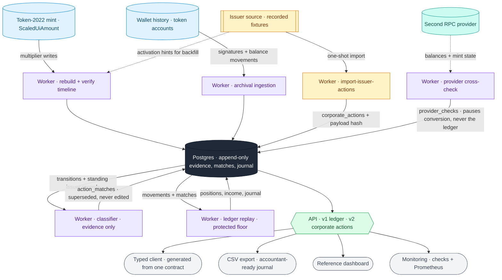

# Corpact

Corporate-action accounting for tokenized equities on Solana, classified from issuer evidence.

Tokenized stocks such as xStocks pay dividends, split and spin off by rewriting a **balance multiplier on
the mint**. No cash moves, no transfer happens, and no event reaches a transfer-based indexer. Read
naively, that data produces confidently wrong numbers: a spin-off books as ~95% income, a split looks
like a windfall, and an issuer cash figure that cannot reconcile with the shares delivered becomes
revenue.

Corpact reads every multiplier change from chain history, matches it against the issuer's own corporate
action, and books it as one of eight validated action types — or refuses to book it and says why. The
result is an append-only ledger with dividend income, a protected-principal floor, exact basis across
spin-offs and identity changes, coverage on every position, and the evidence behind each number, served
over one typed API.

Built on Token-2022 Scaled UI Amount, `@solana/kit`, Postgres, Fastify and Next.js. Issuer data is read
through one adapter, defaulting to recorded fixtures.

> **Status: private preview.** The engine runs on live Solana chain data with recorded issuer data.
> Commercial use of the issuer feed is not yet licensed and the regulatory review is pending, so the
> live feed stays switched off. See [phase0-validation.md](docs/findings/phase0-validation.md).

## How it works

A wallet goes from raw chain history to a defensible ledger in five stages:

1. **Observe.** The worker finds every `ScaledUiAmount` multiplier write for a mint, resolves intra-slot
   order, and rebuilds the timeline the token program itself would produce, then verifies it against
   live mint state. A scheduled multiplier activates with **no account write at all**, so activation is
   settled from the finalized cluster clock, not from a transaction.
2. **Match.** Each activated change is paired with the issuer's corporate action on exact multipliers
   (within 4ε of the mint's f64) and an activation time equal to the second. Announcements and cancelled
   revisions are never evidence. No match means no booking.
3. **Classify.** The standing issuer record decides the type, never the size or the label: cash
   dividends, withholding refunds, splits, stock dividends, spin-offs, rights, identity changes. Types
   with no real instance are recognised, held for review, and never booked.
4. **Account.** Positions replay from balance movements into a protected stock floor: income adds
   convertible exposure, basis events rescale principal, spin-offs allocate basis at `ΔM ÷ M_new` with no
   price needed, and identity changes carry basis across the underlying through position lineage. Every
   value is exact `Rational` arithmetic, and USD comes only from issuer cash that reconciles.
5. **Prove.** The replay is reconciled to the exact raw on-chain balance, optionally cross-checked
   against a second RPC provider, and every recognition and reversal is appended to a journal. Issuer
   corrections never rewrite history.

## Architecture



Every stage reads and writes Postgres rather than passing state to the next one: ingestion and the
timeline store what the chain said, the import stores each issuer record with its payload hash, the
classifier reads both back and writes a match, and the ledger replays from stored movements and matches.
Each stage is a separate job, so any of them can re-run over the same evidence and reach the same
answer. The only direct issuer reads are that one-shot import and the activation hints the backfill uses
to find writes on chain; the worker's steady-state loop polls **chain state only**.

## Guarantees

- **Nothing is booked without issuer evidence.** A change with no matching record, a mismatched
  activation time, or a ratio that does not reconcile becomes an unclassified adjustment with a stated
  reason. It adds no income and makes nothing convertible.
- **Unknown is never zero.** A dividend whose issuer cash is missing, or implies a reinvestment price
  more than 3× from the asset's own median, keeps its quantity with `usd: null` and is counted as
  unvalued.
- **History is append-only, enforced by the database.** Evidence and journal tables carry
  `forbid_mutation()` triggers on 9 tables. An issuer correction appends a reversal plus a replacement;
  `verify-integrity` re-checks stored payload hashes, the guards, and that the journal equals published
  income.
- **Basis is conserved exactly.** Spin-offs, rights and identity changes move basis with exact rational
  arithmetic, property-tested so no chain of events creates or loses basis.
- **Partial history is never dressed up.** Every position is `complete`, `partial` or `unsupported`, and
  a yield figure is claimed only for a fully replayed position over a window its coverage spans.
- **Two providers, one truth.** With `RECONCILIATION_RPC_URL` set, balances and multiplier state are
  cross-checked against a second provider; a disagreement pauses conversion for the affected positions
  without touching the ledger ([ADR-0004](docs/adr/0004-independent-reconciliation-provider.md)).

## Layout

```
packages/domain/      Exact Rational arithmetic, units, the 18-type action taxonomy, the lifecycle state
                      machine (announced → confirmed → activated → corrected | reversed | superseded),
                      and position lineage with exact basis conservation.
packages/accounting/  The evidence classifier and the ledger reducer: income, quantity-basis,
                      basis-allocation and identity treatments. Pure and deterministic.
packages/solana/      Token-2022 mint decoding, the multiplier timeline (mirrors the program's
                      processor), the transaction parser, and a kit-based chain reader.
packages/issuers/     Issuer adapters behind IssuerSource: recorded fixtures (default) or live.
packages/db/          Postgres schema and migrations, the job outbox, immutable observations, monitoring
                      snapshots, and the integrity checker.
packages/client/      One set of JSON schemas that generate the OpenAPI document, the server validation
                      and the typed fetch client.
apps/worker/          Registry verification, archival ingestion, timeline rebuild, classification,
                      position replay, journaling, and provider cross-checks.
apps/api/             Read-only HTTP API: v1 ledger, v2 corporate actions, CSV export, monitoring.
apps/site/            Homepage and developer docs, with a live API sandbox.
apps/web/             Reference dashboard: a demo of the API, not the product.
apps/demo/            The end-to-end demo on a local validator, the recorded-case report, and the
                      mainnet lineage check.
```

pnpm workspaces on Node 24. Design decisions are in [docs/adr/](docs/adr/); the original product plan is
[PLAN.md](PLAN.md).

## Tests

```bash
pnpm test        # 244 tests across 25 files
pnpm typecheck
pnpm --filter @corpact/api openapi:check
```

The suite pins the findings, not just the code: all 654 recorded multiplier changes classify into 630
dividends, 10 splits, 7 distributions, 1 identity change and 6 unexplained changes; spin-offs never book
as income; SCCOx's six issuer revisions resolve on the delivered record; KRAQx's rights sale is caught
despite its `UnitSplit` label; withholding is deducted exactly once; and property tests assert basis
conservation and that no basis event creates convertible exposure. CI also applies the migrations twice
against a fresh Postgres and runs `verify-integrity`.

The end-to-end demo runs the whole flow on a local validator and checks every number through the real
API: **59 of 59 checks pass on Surfpool and on `solana-test-validator`**.

## Running it

```bash
# the demo: prerequisites, install, Postgres, and a full local run (~5 min, no keys)
pnpm demo
tools/demo/run-demo.sh solana-test-validator    # the same demo on the Agave validator

# a real wallet against mainnet
pnpm install
cp .env.example .env                 # set SOLANA_RPC_URL (archival; stays server-side)
docker compose up -d                 # Postgres on 127.0.0.1:54329

cd apps/worker
pnpm cli migrate
pnpm cli sync-registry               # verify every recorded xStock mint on chain
pnpm cli import-issuer-actions       # corporate actions from fixtures (no network)
pnpm start                           # job queue + chain-only mint polling

cd ../api
pnpm tenants create demo "Demo"
pnpm keys create backend --tenant demo --scopes assets:read,ledger:read,wallets:sync
PORT=4600 pnpm start
```

Then sync a wallet with `pnpm cli sync-wallet <address>` in `apps/worker`, or
`POST /v1/wallets/sync`. Read it back:

```ts
import { createCorpactClient } from '@corpact/client';

const corpact = createCorpactClient({ baseUrl: 'http://127.0.0.1:4600', apiKey: process.env.CORPACT_API_KEY });

const { actions } = await corpact.v2.actions(wallet);   // type, treatment, lifecycle, evidence
const { positions } = await corpact.portfolio(wallet);  // floor, convertible amount, coverage
```

Other entry points: the docs and sandbox with `pnpm --filter @corpact/site dev`
(http://localhost:3700), the dashboard with `pnpm dev --port 3600` in `apps/web`, the recorded-case
report with `pnpm --filter @corpact/demo catches`, and the mainnet identity-change check with
`pnpm --filter @corpact/demo lineage-check`.

**API access.** Every route except `/v1/health` and `/v1/openapi.json` needs a bearer key; only a
SHA-256 of each key is stored. Keys hold a subset of `assets:read`, `ledger:read`, `wallets:sync` and
`ops:read`, and read only the wallets their tenant registered — any other wallet answers
`404 wallet_not_registered`, so one customer cannot learn which wallets another tracks. Rate limits are
per key. Browsers never hold a key: the dashboard calls its own server route.

**The issuer-data constraint.** The xStocks feed has no commercial licence and its terms prohibit
automated retrieval. Every issuer read goes through `IssuerSource`; `ISSUER_SOURCE=fixtures` is the
default and makes no network calls, `live` is the only switch, and no scheduled job ever reads the
issuer — the worker loop polls chain state only. `tools/record-fixtures.mjs` and the scripts in
`tools/validate/` do call the live feed; do not run them until licensing is resolved.

## Future scope

- **Conversion.** Turn the convertible amount into an actual harvest: sell dividend-attributed exposure
  to USDC through a vault, with the protected floor enforced on-chain rather than in the ledger alone.
- **A second issuer.** The classifier is one adapter away from other tokenized-equity issuers; the
  taxonomy, lifecycle and lineage are already issuer-neutral.
- **Event-time pricing.** A price source with staleness and disagreement rules would let dividends
  without issuer cash carry a market valuation, and would turn distribution yield from null into a
  number.
- **The remaining action types.** Cash and mixed mergers, redemptions, delistings and fractional
  cash-in-lieu are recognised but never booked, because no real instance exists to validate them
  ([ADR-0006](docs/adr/0006-zero-instance-action-types.md)). Each becomes bookable the day one occurs.
- **Seizure detection.** A permanent-delegate transfer would currently book as a withdrawal. Recording
  each movement's signing authority would let it be flagged as custody, not a sale.
- **Self-serve onboarding.** Accounts, self-managed API keys and per-key usage metering, so integrators
  can start without a hand-created tenant.
- **Streaming.** Webhooks or SSE for new actions and corrections, so consumers stop polling
  `GET /v2/actions`.
```
